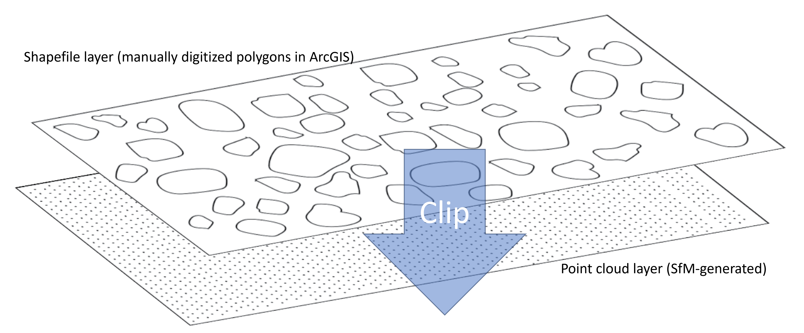

# Differences in spectral indices of point cloud profiles of Healthy 'Green' trees vs Dead 'Gray' trees vs Damaged 'Top-kill' trees

### Loading necessary libraries

```{r warning=FALSE, message=FALSE}

# Load necessary libraries

library(sp)
library(sf)
library(raster)
library(rLiDAR)
library(lidR)
library(rgdal)
library(terra)
library(ggplot2)
library(rgl)
library(gridExtra)
library(agricolae)
library(data.table)
library(plotly)
library(MASS)
library(rayshader)
```

## Preparing point cloud dataset for each tree type

Tasks for this section of the script are as follows:  

* Import UAV site point cloud data set (in .las format created in Agisoft metashape)
* Import shapefile representing each tree type (created in ArcGIS Pro)
* Clip manually digitized polygon to UAV site point cloud data set to create point cloud profiles of individual tree types. 

Conceptual diagram for working principle of the `clip_roi` function from the `lidR` package:


<br>

*To run this script on your own console, please assign ~PATH/FILENAME appropriately*

```{r warning=FALSE, eval=FALSE, message=FALSE}

# NOT RUN

# IMPORTING point cloud as LAS catalog (easier to clip multifeature polygon) 

las <- readLAScatalog("~\Site_pointcloud.las")

las$CRS #to check the CRS of the imported las. Returns 6340 -> EPSG code for NAD83(2011) / UTM zone 11N


# Importing shapefile for clipping in spatial 'simple feature' (sf) class 

sf <- st_read(dsn = "~\TreeType.shp")

st_crs(sf) #make sure both point cloud dataset and shapefile are in the same CRS (las$CRS == st_crs(sf))


# Clipping PC to shp 

# Set destination file path and filenaming rule (based on 'ID' feature of 'sf' dataset)
opt_output_files(las) <- "~\Tree_{TreeType}"

# Clip PC to shp
clipped_las <- clip_roi(las,sf)
```

## Data manipulation, visualization, and statistical analyses of point cloud profile of tree type. 

### Importing clipped point cloud profile datasets of each tree type
```{r warning=FALSE}

# Import Point Cloud as .txt file

topkill <- read.table('TopKill_Set.txt', sep = "\t", header = TRUE)

graytree <- read.table('GrayTree_Set.txt', sep = "\t", header = TRUE)

fulltree <- read.table('FullTree_Set.txt', sep = "\t", header = TRUE)

```

### Renaming the columns of the imported dataframes
```{r warning=FALSE}
# Rename columns

colnames(topkill) <- c("x", "y", "z", "blue", "green", "red", "RedEdge", "NIR", "R", "G", "B")
colnames(graytree) <- c("x", "y", "z", "blue", "green", "red", "RedEdge", "NIR", "R", "G", "B")
colnames(fulltree) <- c("x", "y", "z", "blue", "green", "red", "RedEdge", "NIR", "R", "G", "B")

```

### Re-calculating original reflectance values 

Calibration/corrections from Agisoft Metashape Calibration workflow (MicaSense RedEdge MX sensor) stores the point cloud data by multiplying by 10000 (for efficient storage). Therefore, we need to divide by 10000 to get true reflectance values. 

```{r warning=FALSE}
# Convert values to reflectances 

topkill[4:8] <- (topkill[4:8]/10000)
graytree[4:8] <- (graytree[4:8]/10000)
fulltree[4:8] <- (fulltree[4:8]/10000)
```

### Initial Data exploration of imported point cloud profiles of each tree type:

*Plot outputs are shown after the listed script*

#### Density distribution of spectral bands of point cloud profiles of each tree type
```{r warning=FALSE, out.width="100%"}

# Create gg-subplot objects of spectra by tree type and merge into one plot

ft <- ggplot(fulltree)+
        geom_density(aes(x = blue, color = "blue")) +
        geom_density(aes(x = green, color = "green")) +
        geom_density(aes(x = red, color = "red")) +
        geom_density(aes(x = RedEdge, color = "RedEdge")) +
        geom_density(aes(x = NIR, color = "NIR")) +
        scale_color_manual(values = c("blue", "green", "orange", "red", "pink"), 
                           name = "Wavelength") +
        labs(x = "Wavelength (nm)", 
             y = "Density",
             title = "Green ('healthy') tree")+
        theme(plot.title=element_text(size=10))
  
gt <- ggplot(graytree)+
        geom_density(aes(x = blue, color = "blue")) +
        geom_density(aes(x = green, color = "green")) +
        geom_density(aes(x = red, color = "red")) +
        geom_density(aes(x = RedEdge, color = "RedEdge")) +
        geom_density(aes(x = NIR, color = "NIR")) +
        scale_color_manual(values = c("blue", "green", "orange", "red", "pink"), 
                           name = "Wavelength") +
        labs(x = "Wavelength (nm)", 
             y = "Density",
             title = "Gray ('dead') tree")+
  theme(plot.title=element_text(size=10))

tk <- ggplot(topkill)+
        geom_density(aes(x = blue, color = "blue")) +
        geom_density(aes(x = green, color = "green")) +
        geom_density(aes(x = red, color = "red")) +
        geom_density(aes(x = RedEdge, color = "RedEdge")) +
        geom_density(aes(x = NIR, color = "NIR")) +
        scale_color_manual(values = c("blue", "green", "orange", "red", "pink"), 
                           name = "Wavelength") +
        labs(x = "Wavelength (nm)", 
             y = "Density",
             title = "Top-kill ('damaged') tree")+
  theme(plot.title=element_text(size=10))

grid.arrange(ft, gt, tk, nrow = 2, ncol = 2)
```

### Combining point cloud profile datasets of tree types into a merged dataset

Copying imported datasets into a new synthetic dataframe to create new column 'TreeType', then aggregate synthetic dataframes into a main dataframe with point cloud data from all types of trees
```{r warning=FALSE}
# create copy of dataset

fulltree_temp <- fulltree
graytree_temp <- graytree
topkill_temp <- topkill
```

Creating columns in the synthetic dataframes to specify from where the point cloud data is coming from (green tree vs gray tree vs top-kill tree)
```{r warning=FALSE}

# assign tree type to rows

fulltree_temp$TreeType <- "Full_Tree"
graytree_temp$TreeType <- "Gray_Tree"
topkill_temp$TreeType <- "Top_Kill"
```

Creating main dataframe called 'main_data' and setting Tree Type as factor
```{r warning=FALSE}
# combine data frame

main_data <- rbind(fulltree_temp,graytree_temp,topkill_temp)
main_data$TreeType <- factor(main_data$TreeType)
```

Creating a concatenated list of colors for creating plots *useful for creating a color theme for plotting*

```{r warning=FALSE}
# color pallete for plotting

mycolors <- c("chartreuse4", "darkgray", "orange") #for green, gray, and top-kill trees respectively.

```
 
### Creating density plots of each band by tree type from merged data set 

```{r warning=FALSE, out.width="100%"}
blue <- ggplot(main_data, aes(blue, color = TreeType))+
          geom_density(linewidth = 0.75)+
          scale_color_manual(values = mycolors)+
          labs(x = "Wavelength (nm)", 
               y = "Density", 
               title = "Blue")+
          theme(legend.position = "none")
green <- ggplot(main_data, aes(green, color = TreeType))+
  geom_density(linewidth = 0.75)+
  scale_color_manual(values = mycolors)+
  labs(x = "Wavelength (nm)", 
       y = "Density", 
       title = "Green")+
  theme(legend.position = "none")

red <- ggplot(main_data, aes(red, color = TreeType))+
  geom_density(linewidth = 0.75)+
  scale_color_manual(values = mycolors)+
  labs(x = "Wavelength (nm)", 
       y = "Density", 
       title = "Red")+
  theme(legend.position = "none")

RedEdge <- ggplot(main_data, aes(RedEdge, color = TreeType))+
  geom_density(linewidth = 0.75)+
  scale_color_manual(values = mycolors)+
  labs(x = "Wavelength (nm)", 
       y = "Density", 
       title = "RedEdge")+
  theme(legend.position = "none")

NIR <- ggplot(main_data, aes(NIR, color = TreeType))+
  geom_density(linewidth = 0.75)+
  scale_color_manual(values = mycolors,
                     name = "Tree Type", 
                     labels = c("Green 'Healthy' Tree", "Gray 'Dead' Tree", "Top-kill 'Damaged' Tree"))+
  labs(x = "Wavelength (nm)", 
       y = "Density", 
       title = "NIR")

grid.arrange(arrangeGrob(blue, green, red, ncol=3, nrow=1),
             arrangeGrob(RedEdge, NIR, ncol=2, nrow=1, widths=c(1,2))) 

```

Visual assessment of the resulting plots suggests differences in spectral characteristics (wavelengths only) is not enough. The results suggests calculations of spectral indices might help in extracting distinctions between tree types. 

##### Creating new columns for indices and performing calculations

```{r warning=FALSE}
main_data$NDVI <- (main_data$NIR-main_data$red)/(main_data$NIR+main_data$red)
main_data$NDRE <- (main_data$NIR-main_data$RedEdge)/(main_data$NIR+main_data$RedEdge)
main_data$SR <- (main_data$NIR/main_data$red)
main_data$GLI <- ((main_data$green - main_data$red)+(main_data$green - main_data$blue))/((2*main_data$green)+main_data$red+main_data$blue)

```

### Creating density plots of calculated spectral indices by tree type 

```{r warning=FALSE, out.width="100%"}
NDVI <- ggplot(main_data)+
          geom_density(aes(NDVI, color = TreeType))+
          scale_color_manual(values = mycolors,
                             name = "Tree Type", 
                             labels = c("Green 'Healthy' Tree", "Gray 'Dead' Tree", "Top-kill 'Damaged' Tree"))+
            labs(x = "Wavelength (nm)", 
                 y = "Density", 
                 title = "NDVI")

NDRE <- ggplot(main_data)+
          geom_density(aes(NDRE, color = TreeType))+
          scale_color_manual(values = mycolors,
                             name = "Tree Type", 
                             labels = c("Green 'Healthy' Tree", "Gray 'Dead' Tree", "Top-kill 'Damaged' Tree"))+
          labs(x = "Wavelength (nm)", 
               y = "Density", 
               title = "NDRE")


SR <- ggplot(main_data)+
        geom_density(aes(SR, color = TreeType))+
        scale_color_manual(values = mycolors,
                           name = "Tree Type", 
                           labels = c("Green 'Healthy' Tree", "Gray 'Dead' Tree", "Top-kill 'Damaged' Tree"))+
        labs(x = "Wavelength (nm)", 
             y = "Density", 
             title = "SR")


GLI <- ggplot(main_data)+
        geom_density(aes(GLI, color = TreeType))+
        scale_color_manual(values = mycolors,
                           name = "Tree Type", 
                           labels = c("Green 'Healthy' Tree", "Gray 'Dead' Tree", "Top-kill 'Damaged' Tree"))+
        labs(x = "Wavelength (nm)", 
             y = "Density", 
             title = "GLI")

grid.arrange(NDVI, NDRE, SR, GLI, nrow = 2, ncol = 2)


```

Visual assessment of the density plots of spectral indices shows promise for Green Leaf Index (GLI) (shows most separation by tree type)

## Statistical Analyses

### ANOVA Analysis for significant differences in GLI by tree type

First we would have to check for normality 
```{r warning=FALSE, out.width="100%"}
ggplot(main_data, aes(GLI))+
  geom_density()+
  labs(x = "Wavelength (nm)", 
       y = "Density")
```

Visual assessment of the plot shows that the distribution is somewhat normal. Moving forward with the ANOVA test. 

Hypotheses for ANOVA: 

Null Hypothesis  
$$
H_0: \mu_{GLI(Green tree)} = \mu_{GLI(Top-kill tree)} = \mu_{GLI(Gray tree)}
$$

Alternate Hypothesis  
$$
H_a: \mu_{GLI(Green tree)} \ne \mu_{GLI(Top-kill tree)} \ne \mu_{GLI(Gray tree)}
$$

ANOVA test using 'aov' function:
```{r warning=FALSE, out.width="100%"}
model1 <- aov(GLI~TreeType, data = main_data)
summary(model1)
```

Before interpreting the results of the ANOVA, we need to run diagnostics on the ANOVA model. 

```{r warning=FALSE, out.width="100%"}
par(mfrow = c(2,2))

res <- residuals(model1)
est <- fitted(model1)

hist(res) #assumption1
plot(est, res); abline(0,0)
qqnorm(res);qqline(res)

```

Visual assessment of the diagnostic plots indicate that ANOVA assumptions are met. 

Results of ANOVA show that the p-value is less than 0.05 rejecting the null hypothesis suggesting that **there are significant differences in GLI by different tree types**.

Now that we know there are significant differences in GLI between tree types, we can run Tukey's HSD multiple comparisons to see in which tree type are GLI significantly different

### Mutliple comparision using Tukey's HSD: 
```{r warning=FALSE, out.width="100%"}
HSD1 <- HSD.test(model1, 'TreeType', group = TRUE, console = TRUE)
```
The p-value of the Tukey's HSD test is less than 0.05, therefore there are significant differences in GLI between point cloud data from green, top-kill, and gray trees. That is, **all tree types are significantly different from each other**


Creating a better visualization of Tukey's HSD results.
```{r warning=FALSE, out.width="100%"}
tukeyLabels <- c("a", "b", "c")
quants <- data.table(main_data)[, list(quant = as.numeric(quantile(GLI)[3])), by = TreeType] # creating a dataframe to insert labels on boxplots that aligns on the 3rd quantile of the distribution of GLI for each tree type. 

ggplot(main_data, aes(TreeType,GLI, fill = TreeType)) +
  geom_boxplot(size = 0.75) + 
  labs(title = "Tukey's HSD results", 
       x = "Tree Type", 
       y = "Green Leaf Index (GLI)") +
  scale_fill_manual(values = mycolors)+
  scale_x_discrete(labels = c("Green 'Healthy' Tree", "Gray 'Dead' Tree", "Top-kill 'Damaged' Tree"))+
  guides(fill = "none")+
  geom_text(data = quants, aes(x = TreeType, y = quant, label = tukeyLabels), size = 10)

```

Seems like there might be use of elevation data from the point clouds of each tree type. Since there is less green on the top of top-killed trees, not as much green throughout the elevation of a gray tree (dead tree), and mostly all green throughout the elevation of a healthy green tree. 

It would be interesting to create a 2D density plot with elevation (z value of point in point cloud) determining the GLI of the point. 

Using the geom_density_2d function in ggplot to create a 2D density plot with GLI on the x-axis and elevation on the y-axis. The contour lines for represent the density of points for respective tree type: 

```{r warning = FALSE, out.width="100%"}
ggplot(main_data, aes(GLI, z, color = TreeType))+
  geom_density_2d(linewidth = 1)+
  scale_color_manual(values = mycolors,
                     name = "Tree Type", 
                     labels = c("Green 'Healthy' Tree", "Gray 'Dead' Tree", "Top-kill 'Damaged' Tree"))+
  labs (x = "Green Leaf Index", 
        y = "Elevation (z)", 
        title = "GLI and Elevation density by Tree Type")
```  
From the 2D density plot, it can be inferred that: 

  * In general, the GLI of healthy trees are higher (as most of the points lie for healthy trees lie on the right hand side on the x-axis) compared to the GLI of top-killed and dead trees. 
  * Taking the elevation of each point cloud into consideration, most points representing healthy tree show higher GLI along the range of the elevation, which followed by points representing top-killed trees, and lastly points representing dead trees. 
  * The elevation (z) can also be used as inference to tree height where the elevation values of the points roughly show where on the relative height of the trees do the points lie and what GLI values they have. With this inference, we can deduce that: 
    + In general, healthy trees show higher GLI along the height of the tree. 
    + Top-kill trees show lower GLI than the healthy trees compared, especially in the higher elevations (higher tree heights). This inference seems to agree with our general understanding, as top-killed trees have less vegetation on the higher heights of the tree. 
    + Dead trees show lower GLI in general throughout the inferred height of the tree compared to top-killed and healthy trees. This also makes sense as dead trees have even less vegetation than top-killed and healthy trees. 

2D density plot shows there is a potential grouping with GLI index for each point in the point cloud and the elevation of each point of on the point cloud (with inference to the relative height of the tree). **I.E.: points in the point cloud representing healthy trees have higher GLI throughout the height of the trees, points representing top-kill show lower GLI especially on the higher heights of the tree, and points representing dead trees show low GLI throughout the height of the tree.** 

The above shown 2D density plot can also be visualized with color intensity (purple to yellow color scale) using 'geom_density_2d_filled'. Yellower colors represent higher point density. 

```{r warning=FALSE, out.width="100%"}
ggplot(main_data, aes(GLI, z))+
  geom_density_2d_filled(contour_var = "ndensity")+
  geom_density_2d(aes(color = TreeType))+
  scale_color_manual(values = mycolors,
                     name = "Tree Type", 
                     labels = c("Green 'Healthy' Tree", "Gray 'Dead' Tree", "Top-kill 'Damaged' Tree"))+
  labs (x = "Green Leaf Index", 
        y = "Elevation (z)", 
        title = "GLI and Elevation density by Tree Type")+
  guides(fill = "none")

```
The above 2D filled density plot can also be faceted into tree types: 

```{r warning=FALSE, out.width="100%"}
ggplot(main_data, aes(GLI, z))+
  geom_density_2d_filled(contour_var = "ndensity")+
  geom_density_2d(aes(color = TreeType))+
  facet_wrap(TreeType~.)+
  scale_color_manual(values = mycolors,
                     name = "Tree Type", 
                     labels = c("Green 'Healthy' Tree", "Gray 'Dead' Tree", "Top-kill 'Damaged' Tree"))+
  labs (x = "Green Leaf Index", 
        y = "Elevation (z)", 
        title = "GLI and Elevation density by Tree Type")+
  guides(fill = "none")

```

<hr>

### Here are some interesting ways to display the above 2D density data as **Interactive 3D representations**!!!

Using the [rayshader](https://www.rayshader.com/index.html) R-package to create an interactive 3D rendering of the 2D density (filled) plot:  

***Feel free to use your mouse to drag and pan the 3D representation***

```{r warning=FALSE, out.width="100%"}
Density2D <- ggplot(main_data, aes(GLI, z))+
  stat_density_2d_filled(aes(fill = stat(nlevel)))+
  facet_wrap(TreeType~.)+
  labs (x = "Green Leaf Index", 
        y = "Elevation (z)", 
        title = "GLI and Elevation density by Tree Type")+
  scale_fill_viridis_c(option = "A")

# par(mfrow = c(1, 2))
# plot_gg(Density2D, width = 4, height = 4, raytrace = FALSE, preview = TRUE)
plot_gg(Density2D, 
        multicore = TRUE, 
        raytrace = TRUE, 
        width = 4, 
        height = 4, 
        scale = 300, 
        windowsize = c(1200, 960), 
        zoom = 0.5, 
        phi = 50, 
        theta = 35)

Sys.sleep(0.2)
#render_snapshot(clear = TRUE) #un-comment to create a snapshot image of the 3D view (downloadable) 
rgl::rglwidget()

```

Another interactive 3D plot created using the [plotly](https://plotly.com/r/3d-charts/) R-package to represent the above 2D density plot:
 
```{r, warning=FALSE, out.width="100%"}
kd <- kde2d(main_data$GLI, main_data$z)

fig <- plot_ly(x = kd$x, y = kd$y, z = kd$z) %>% add_surface()
fig
```
